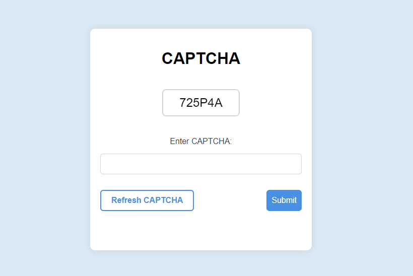
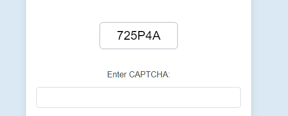
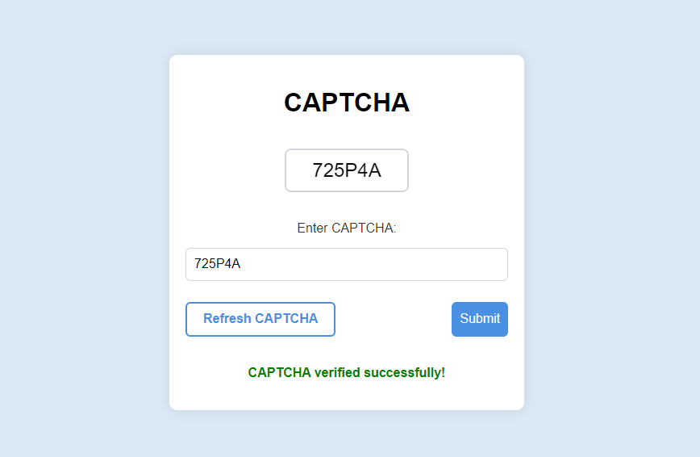

# ProShield-CAPTCHA

 ProShield CAPTCHA is a simple and secure CAPTCHA implementation using HTML, CSS, JavaScript, and PHP. This project demonstrates how to create and validate a CAPTCHA to protect forms from automated submissions. 
 <h2>Features</h2> <ul> <li>Generates a random CAPTCHA image</li> <li>Validates user input against the generated CAPTCHA</li> <li>Simple and clean design</li> <li>Easy to integrate into existing projects</li> </ul> <h2>Technologies Used</h2> <ul> <li>HTML</li> <li>CSS</li> <li>PHP</li> <li>JavaScript</li> </ul> <h2>Installation</h2> <ol> <li>Clone the repository: <pre><code>git clone [(https://github.com/krsakshi/ProShield-CAPTCHA)]</code></pre> </li> <li>Navigate to the project directory: <pre><code>cd proshield-captcha</code></pre> </li> <li>Ensure you have PHP installed on your server.</li> <li>Place the project files in your web server's root directory.</li> <li>Make sure the <code>arial.ttf</code> font file is available in the same directory as <code>captcha.php</code>. You can download it from <a href="https://fonts.google.com/specimen/Arial">Google Fonts</a> or use any other TTF font file.</li> </ol> <h2>Usage</h2> <ol> <li>Open <code>index.html</code> in your web browser.</li> <li>Enter the CAPTCHA code displayed in the image.</li> <li>Click the "Submit" button to verify the CAPTCHA.</li> </ol> <h2>Project Structure</h2> <ul> <li><code>index.html</code>: The main HTML file containing the form and CAPTCHA image.</li> <li><code>styles.css</code>: The CSS file for styling the form and CAPTCHA elements.</li> <li><code>captcha.php</code>: The PHP script that generates the CAPTCHA image and stores the code in a session.</li> <li><code>verify.php</code>: The PHP script that verifies the user input against the stored CAPTCHA code.</li> </ul> <h2>Screenshots</h2> 
 <h3>Main Page</h3>  <h3>CAPTCHA Image</h3>  <h3>Verification Result</h3>  
 <h2>License</h2> 
 This project is licensed under the MIT License. See the <a href="https://github.com/krsakshi/ProShield-CAPTCHA/blob/main/LICENSE">LICENSE</a> file for details. 
Font used: <a href="https://fonts.google.com/specimen/Arial">Arial</a>. 
 <h2>Contributing</h2> 
 Contributions are welcome! Please open an issue or submit a pull request for any improvements or bug fixes. 
 
 
 
ProShield CAPTCHA - A simple and secure solution for your form protection needs.
 
 </body> </html>
